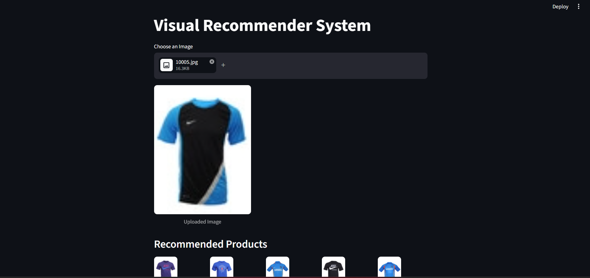

# 🛍️ Visual Product Recommender System

A Deep Learning-based **Visual Product Recommender System** that recommends visually similar products based on an uploaded image. The system extracts deep visual features using a pre-trained **ResNet50** model and retrieves the most similar products using the **K-Nearest Neighbors (KNN)** algorithm with **Cosine Similarity**.

This project demonstrates the practical application of **Computer Vision**, **Deep Learning**, and **Image Similarity Search** for product recommendation.

---

# 📸 Project Output



---

---

# 🌐 Live Demo

🔗 https://visualappuctrecommendersystem-dt8apaxvnqw67vafjskbnh.streamlit.app/..

---


# 🚀 Features

- Upload an image through a Streamlit web interface
- Deep feature extraction using ResNet50
- Automatic image preprocessing
- Generate normalized feature embeddings
- Visual similarity search using K-Nearest Neighbors (KNN)
- Cosine Similarity based recommendation
- Display Top-5 visually similar products
- Fast inference using precomputed embeddings
- Interactive and user-friendly interface

---

# 🛠️ Tech Stack

- Python
- TensorFlow / Keras
- ResNet50 (Pre-trained CNN)
- NumPy
- Scikit-learn (KNN)
- Streamlit
- Pillow (PIL)
- Pickle
- tqdm

---

# 📂 Project Structure

```text
Visual_Product_Recommender_System/
│
├── images_small/
├── uploads/
├── app.py
├── main.py
├── test.py
├── generate_embeddings.py
├── embeddings.pkl
├── filenames.pkl
├── requirements.txt
├── Output.png
├── README.md
└── .gitignore
```

---

# ⚙️ Installation

Clone the repository

```bash
git clone https://github.com/saloni1709/Visual_Recommender_System.git
```

Go to the project folder

```bash
cd Visual_Recommender_System
```

Install dependencies

```bash
pip install -r requirements.txt
```

---

# ▶️ Run the Project

### Step 1: Generate Embeddings

```bash
python generate_embeddings.py
```

This creates:

- embeddings.pkl
- filenames.pkl

### Step 2: Start the Streamlit Application

```bash
streamlit run main.py
```

---

# 🧠 Working

1. Upload a product image.
2. The image is resized to **224 × 224**.
3. ResNet50 extracts deep visual features.
4. Features are normalized to create embeddings.
5. KNN compares the uploaded image with stored embeddings using Cosine Similarity.
6. The system retrieves the Top-5 visually similar products.
7. Recommended products are displayed in the Streamlit interface.

---

# 🔄 Workflow

```text
Input Image
      │
      ▼
Image Preprocessing
      │
      ▼
ResNet50 Feature Extraction
      │
      ▼
Feature Embedding
      │
      ▼
KNN + Cosine Similarity
      │
      ▼
Top-5 Similar Products
```

---

# 🤖 Machine Learning Model

### Feature Extraction

- ResNet50 (ImageNet Pre-trained)
- GlobalMaxPooling2D

### Similarity Search

- K-Nearest Neighbors (KNN)
- Cosine Similarity

---

# 📊 Dataset

This project uses a **small subset** of a Fashion Product Images dataset (`images_small`) for demonstration purposes.

A reduced dataset was used to:

- Reduce repository size
- Speed up embedding generation
- Enable faster testing and deployment

The same pipeline can be applied to the complete dataset without major code changes.

---

# 📈 Current Implementation

✔ Streamlit Web Interface

✔ Image Upload

✔ ResNet50 Feature Extraction

✔ Image Embeddings Generation

✔ KNN-based Recommendation

✔ Cosine Similarity Search

✔ Top-5 Product Recommendation

---

# ⚠️ Limitations

- Uses a subset of the dataset.
- Recommendations are based only on visual appearance.
- Product metadata such as brand, price and description are not considered.
- Siamese Network and FAISS are planned for future implementation.

---

# 👩‍💻 Author

**Swasti Jain**

B.Tech – Computer Science Engineering

Poornima Institute of Engineering & Technology

GitHub:
https://github.com/swasti1918

---

# 🙏 Acknowledgements

- TensorFlow
- Keras
- Streamlit
- Scikit-learn
- ImageNet
- Fashion Product Images Dataset

---
